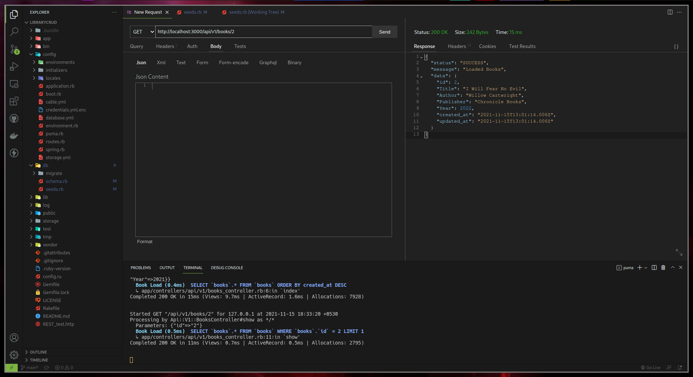

<h1>
    <center>CRUD REST API for Library Books Using Ruby on Rails</center>
    <center>Project Report</center>
</h1>
<p><center>Anish Sharma, B181065CS</center></p>
<p><center>Arjun Syam, B180031CS</center></p>
<p><center>Dev Sony, B180297CS</center></p>

[Github Repo](https://github.com/HotMonkeyWings/LibraryCRUD)

## Problem Statement
The following specifications have been given -

- Fetch the data from the database and send the response in JSON.
- Post the request to the API to perform the database operations. The post request method must display the books newly added to the database collection.
- Create a database to store the details of books.
- Book[B_id, B_title, Author, Publisher, Year]

We have to develop the API using the Ruby on Rails framework and with MVC architecture.

## Procedure
We first create a new RoR application using the `rails` utility.
```
rails new LibraryCRUD --api
```

## Setup the Database
Since we are using a MySQL database for this project, we need to configure the database options inside `config/database.yml`

```
default: &default
  adapter: mysql2
  username: monkeywings
  password: 3p1cburg3r
  pool: <%= ENV.fetch("RAILS_MAX_THREADS") { 5 } %>
  timeout: 5000

development:
  <<: *default
  database: LibraryBooks

# Warning: The database defined as "test" will be erased and
# re-generated from your development database when you run "rake".
# Do not set this db to the same as development or production.
test:
  <<: *default
  database: LibraryBooks

production:
  <<: *default
  database: LibraryBooks
```

We also add `mysql2` in the Gemfile and install mysql2 using `gem install mysql2`

Next, following the MVC architecture, we create the following `book` model for the database.
```
rails g model book Title:string Author:string Publisher:string Year:integer
```
Now in order to generate tables in the MySQL database according to this, we need to run a database migration using the `rails` utility.

```
rails db:migrate
```

Finally we configure `db/seeds.rb` to populate the database with books using the [Faker Library](https://github.com/faker-ruby/faker) for Ruby on Rails.
```
5.times do
    Book.create({
        Title: Faker::Book.title,
        Author: Faker::Book.author,
        Publisher: Faker::Book.publisher,
        Year: Faker::Number.between(from: 1800, to: 2022)
    })
end
```
Then we can run the following command to populate the database.
```
rails db:seed
```

## Building the API

We create a new controller for the endpoint `/api/v1/books`
```
rails g controller api/v1/books index show create update destroy
```

After that we update the API code to execute the CRUD operations appropriately. The API code is located in `app/controllers/api/v1/books_controller.rb`

Once we have defined the correct functionality in the code, we can start the server using the following command
```
rails s
```

## Testing the API
We can now use a REST Client Utility such as Postman or the REST Client extension in VSCode to send HTTP requests to this server and test the functionality.

Here are the HTTP requests that have been stated in the question, their responses in JSON format and screenshots from Postman.

### GET All Books in the DB

**Request**

```GET http://localhost:3000/api/v1/books HTTP/1.1```

**Response**

```
{
    "status": "SUCCESS",
    "message": "Loaded Books",
    "data": [
        {
            "id": 5,
            "Title": "Mother Night",
            "Author": "Elidia Wisoky Jr.",
            "Publisher": "Harvard University Press",
            "Year": 1985,
            "created_at": "2021-11-14T14:22:07.670Z",
            "updated_at": "2021-11-14T14:22:07.670Z"
        },
        {
            "id": 4,
            "Title": "Many Waters",
            "Author": "Rev. Jimmy Dare",
            "Publisher": "Banner of Truth Trust",
            "Year": 1929,
            "created_at": "2021-11-14T14:22:07.666Z",
            "updated_at": "2021-11-14T14:22:07.666Z"
        },
        {
            "id": 3,
            "Title": "Pale Kings and Princes",
            "Author": "Sang Lynch",
            "Publisher": "Hawthorne Books",
            "Year": 1970,
            "created_at": "2021-11-14T14:22:07.662Z",
            "updated_at": "2021-11-14T14:22:07.662Z"
        },
        {
            "id": 2,
            "Title": "Great Work of Time",
            "Author": "Jess Barrows",
            "Publisher": "Shuter & Shooter Publishers",
            "Year": 1897,
            "created_at": "2021-11-14T14:22:07.656Z",
            "updated_at": "2021-11-14T14:22:07.656Z"
        },
        {
            "id": 1,
            "Title": "The Glory and the Dream",
            "Author": "Anya Harris",
            "Publisher": "Edupedia Publications",
            "Year": 1970,
            "created_at": "2021-11-14T14:22:07.652Z",
            "updated_at": "2021-11-14T14:22:07.652Z"
        }
    ]
}
```


### GET A book using its ID

**Request**

```GET http://localhost:3000/api/v1/books/1 HTTP/1.1```

**Response**

```
{
    "status": "SUCCESS",
    "message": "Loaded Books",
    "data": {
        "id": 1,
        "Title": "The Glory and the Dream",
        "Author": "Anya Harris",
        "Publisher": "Edupedia Publications",
        "Year": 1970,
        "created_at": "2021-11-14T14:22:07.652Z",
        "updated_at": "2021-11-14T14:22:07.652Z"
    }
}
```



### POST to Create a New Book
On a succesful POST request, a response will be given back in JSON format of the newly added book.

**Request**

```
POST http://localhost:3000/api/v1/books HTTP/1.1
Content-Type: application/json

{
    "Title": "1984",
    "Author": "George Orwell",
    "Publisher": "Some Dudes",
    "Year": "1985"
}
```
**Response**
```
{
    "status": "SUCCESS",
    "message": "Loaded Books",
    "data": {
        "id": 6,
        "Title": "1984",
        "Author": "George Orwell",
        "Publisher": "Some Dudes",
        "Year": 1985,
        "created_at": "2021-11-14T14:26:09.496Z",
        "updated_at": "2021-11-14T14:26:09.496Z"
    }
}
```


## Contribution

- Anish Sharma - GET request for Books, Documentation, Database Changes
- Arjun Syam - GET request for Books based on ID, API Testing, Seed Database Values
- Dev Sony - POST request to add a Book, Database Migration/Creation, Documentation